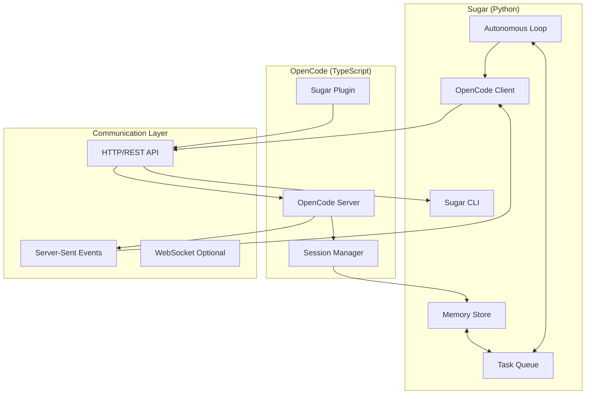
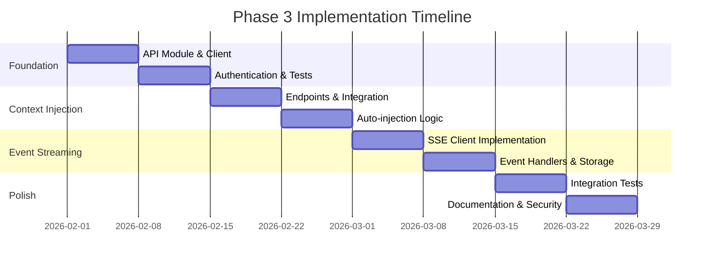

# Phase 3: SDK Integration - Technical Specification

## Executive Summary

Phase 3 enables deep bidirectional integration between Sugar (Python) and OpenCode (TypeScript) through SDK-level communication. This creates a unified autonomous development experience where:

- Sugar can inject context into active OpenCode sessions
- OpenCode can delegate tasks to Sugar's background queue
- Real-time synchronization of task state across both systems
- Shared memory and decision context

**Status:** Planning (follows Phase 1: MCP Tools, Phase 2: OpenCode Plugin)

**Timeline:** 3-4 weeks implementation

**Complexity:** High (cross-language, real-time communication, state synchronization)

---

## 1. Architecture Overview

### 1.1 Communication Pattern



### 1.2 Data Flow Patterns

**Pattern 1: Context Injection (Sugar → OpenCode)**
```
1. Sugar detects relevant memories/context
2. Sugar calls OpenCode SDK to inject into active session
3. OpenCode receives context via session.prompt()
4. Context appears in OpenCode session history
```

**Pattern 2: Task Delegation (OpenCode → Sugar)**
```
1. User issues command in OpenCode session
2. Plugin calls Sugar's HTTP API
3. Task added to Sugar queue
4. Sugar processes task autonomously
5. Sugar sends completion event to OpenCode via callback
```

**Pattern 3: Real-time Updates (Bidirectional)**
```
1. Sugar subscribes to OpenCode events via SSE
2. OpenCode session events stream to Sugar
3. Sugar processes events (file changes, prompts)
4. Sugar stores relevant events as memories
5. Sugar can inject follow-up context
```

### 1.3 State Synchronization Strategy

**Shared State:**
- Task status (pending, in_progress, completed, failed)
- Session context (current files, recent changes)
- Memory entries (decisions, preferences, patterns)

**Conflict Resolution:**
- Sugar is source of truth for task queue
- OpenCode is source of truth for active session state
- Memory store uses last-write-wins with timestamps
- Task ownership: one executor at a time (lock mechanism)

---

## 2. Sugar-Side SDK Client (Python)

### 2.1 Module Structure

```
sugar/integrations/opencode/
├── __init__.py
├── client.py           # Main OpenCode client
├── session.py          # Session injection helpers
├── events.py           # Event subscription handlers
├── models.py           # TypeScript type equivalents
└── exceptions.py       # OpenCode-specific errors
```

### 2.2 OpenCode Client Implementation

```python
# sugar/integrations/opencode/client.py
"""
OpenCode SDK client for Sugar.

Provides Python interface to OpenCode's TypeScript API.
"""

import aiohttp
import asyncio
import json
import logging
from typing import Any, AsyncIterator, Dict, List, Optional
from dataclasses import dataclass
from datetime import datetime

from .models import Session, Message, Event, HealthStatus
from .exceptions import OpenCodeConnectionError, OpenCodeAPIError

logger = logging.getLogger(__name__)


@dataclass
class OpenCodeConfig:
    """Configuration for OpenCode client."""
    base_url: str = "http://localhost:4096"
    timeout: int = 30
    retry_attempts: int = 3
    retry_delay: float = 1.0


class OpenCodeClient:
    """
    Python client for OpenCode SDK.

    Provides async interface to OpenCode's HTTP/SSE API.
    """

    def __init__(self, config: Optional[OpenCodeConfig] = None):
        self.config = config or OpenCodeConfig()
        self._session: Optional[aiohttp.ClientSession] = None
        self._sse_task: Optional[asyncio.Task] = None
        self._event_handlers: List[callable] = []

    async def __aenter__(self):
        await self.connect()
        return self

    async def __aexit__(self, exc_type, exc_val, exc_tb):
        await self.close()

    async def connect(self) -> None:
        """Establish connection to OpenCode server."""
        if self._session is None:
            timeout = aiohttp.ClientTimeout(total=self.config.timeout)
            self._session = aiohttp.ClientSession(timeout=timeout)

        # Verify server is reachable
        health = await self.health_check()
        if not health.ok:
            raise OpenCodeConnectionError(f"OpenCode server unhealthy: {health}")

        logger.info(f"Connected to OpenCode {health.version} at {self.config.base_url}")

    async def close(self) -> None:
        """Close connection and cleanup resources."""
        if self._sse_task:
            self._sse_task.cancel()
            try:
                await self._sse_task
            except asyncio.CancelledError:
                pass

        if self._session:
            await self._session.close()
            self._session = None

    async def health_check(self) -> HealthStatus:
        """Check OpenCode server health."""
        try:
            async with self._session.get(f"{self.config.base_url}/health") as resp:
                if resp.status == 200:
                    data = await resp.json()
                    return HealthStatus(
                        ok=True,
                        version=data.get("version", "unknown"),
                        uptime=data.get("uptime", 0)
                    )
                else:
                    return HealthStatus(ok=False, error=f"HTTP {resp.status}")
        except Exception as e:
            return HealthStatus(ok=False, error=str(e))

    # Session Management

    async def get_session(self, session_id: str) -> Optional[Session]:
        """Get session details by ID."""
        async with self._session.get(
            f"{self.config.base_url}/session/{session_id}"
        ) as resp:
            if resp.status == 200:
                data = await resp.json()
                return Session.from_dict(data)
            elif resp.status == 404:
                return None
            else:
                raise OpenCodeAPIError(f"Failed to get session: HTTP {resp.status}")

    async def list_sessions(self) -> List[Session]:
        """List all available sessions."""
        async with self._session.get(
            f"{self.config.base_url}/session/list"
        ) as resp:
            if resp.status == 200:
                data = await resp.json()
                return [Session.from_dict(s) for s in data.get("sessions", [])]
            else:
                raise OpenCodeAPIError(f"Failed to list sessions: HTTP {resp.status}")

    async def get_active_sessions(self) -> List[Session]:
        """Get currently active sessions."""
        sessions = await self.list_sessions()
        return [s for s in sessions if s.status == "active"]

    async def inject_context(
        self,
        session_id: str,
        context: str,
        context_type: str = "memory"
    ) -> bool:
        """
        Inject context into an active OpenCode session.

        Args:
            session_id: Target session ID
            context: Context text to inject
            context_type: Type of context (memory, decision, error_pattern)

        Returns:
            True if injection successful
        """
        payload = {
            "parts": [
                {
                    "type": "text",
                    "text": f"[Sugar Context: {context_type}]\n\n{context}"
                }
            ],
            "metadata": {
                "source": "sugar",
                "context_type": context_type,
                "injected_at": datetime.utcnow().isoformat()
            }
        }

        async with self._session.post(
            f"{self.config.base_url}/session/{session_id}/prompt",
            json=payload
        ) as resp:
            if resp.status in (200, 201):
                logger.info(f"Injected {context_type} context into session {session_id[:8]}")
                return True
            else:
                logger.error(f"Failed to inject context: HTTP {resp.status}")
                return False

    async def inject_memories(
        self,
        session_id: str,
        memories: List[Dict[str, Any]],
        max_tokens: int = 2000
    ) -> bool:
        """
        Inject relevant memories into OpenCode session.

        Formats memories as markdown and injects as context.
        """
        if not memories:
            return False

        context_lines = ["# Relevant Project Context\n"]

        for memory in memories[:10]:  # Limit to top 10
            memory_type = memory.get("type", "decision")
            content = memory.get("content", "")
            score = memory.get("score", 0.0)

            context_lines.append(f"## {memory_type.title()} (relevance: {score:.2f})")
            context_lines.append(content)
            context_lines.append("")

        context = "\n".join(context_lines)

        # Truncate if too long
        if len(context) > max_tokens * 4:  # Rough estimate
            context = context[:max_tokens * 4] + "\n\n... (truncated)"

        return await self.inject_context(session_id, context, "memories")

    # Event Subscription

    async def subscribe_to_events(self) -> AsyncIterator[Event]:
        """
        Subscribe to OpenCode server events via SSE.

        Yields Event objects as they arrive.
        """
        url = f"{self.config.base_url}/events"

        async with self._session.get(url, headers={"Accept": "text/event-stream"}) as resp:
            if resp.status != 200:
                raise OpenCodeAPIError(f"Failed to subscribe to events: HTTP {resp.status}")

            logger.info("Subscribed to OpenCode event stream")

            async for line in resp.content:
                line = line.decode('utf-8').strip()

                if line.startswith('data: '):
                    data = line[6:]  # Remove 'data: ' prefix
                    try:
                        event_data = json.loads(data)
                        event = Event.from_dict(event_data)
                        yield event
                    except json.JSONDecodeError as e:
                        logger.warning(f"Failed to parse event: {e}")
                        continue

    def add_event_handler(self, handler: callable) -> None:
        """
        Add event handler for OpenCode events.

        Handler should be async callable accepting Event.
        """
        self._event_handlers.append(handler)

    async def start_event_loop(self) -> None:
        """
        Start background event processing loop.

        Subscribes to events and dispatches to registered handlers.
        """
        if self._sse_task:
            logger.warning("Event loop already running")
            return

        async def event_loop():
            while True:
                try:
                    async for event in self.subscribe_to_events():
                        for handler in self._event_handlers:
                            try:
                                await handler(event)
                            except Exception as e:
                                logger.error(f"Event handler failed: {e}")

                except asyncio.CancelledError:
                    logger.info("Event loop cancelled")
                    break
                except Exception as e:
                    logger.error(f"Event stream error: {e}")
                    await asyncio.sleep(5)  # Retry after delay

        self._sse_task = asyncio.create_task(event_loop())
        logger.info("Started OpenCode event loop")

    async def stop_event_loop(self) -> None:
        """Stop the event processing loop."""
        if self._sse_task:
            self._sse_task.cancel()
            try:
                await self._sse_task
            except asyncio.CancelledError:
                pass
            self._sse_task = None
            logger.info("Stopped OpenCode event loop")

    # File Operations

    async def get_file_status(self, session_id: str) -> Dict[str, Any]:
        """Get file status for session."""
        async with self._session.get(
            f"{self.config.base_url}/file/status",
            params={"sessionId": session_id}
        ) as resp:
            if resp.status == 200:
                return await resp.json()
            else:
                raise OpenCodeAPIError(f"Failed to get file status: HTTP {resp.status}")

    async def find_files(self, pattern: str, session_id: Optional[str] = None) -> List[str]:
        """Find files matching pattern."""
        params = {"pattern": pattern}
        if session_id:
            params["sessionId"] = session_id

        async with self._session.get(
            f"{self.config.base_url}/find/files",
            params=params
        ) as resp:
            if resp.status == 200:
                data = await resp.json()
                return data.get("files", [])
            else:
                return []
```

### 2.3 Models (TypeScript Type Equivalents)

```python
# sugar/integrations/opencode/models.py
"""
Python equivalents of OpenCode TypeScript types.
"""

from dataclasses import dataclass, field
from datetime import datetime
from typing import Any, Dict, List, Optional
from enum import Enum


class SessionStatus(Enum):
    ACTIVE = "active"
    IDLE = "idle"
    CLOSED = "closed"


class EventType(Enum):
    SESSION_CREATED = "session.created"
    SESSION_CLOSED = "session.closed"
    PROMPT_SENT = "prompt.sent"
    RESPONSE_RECEIVED = "response.received"
    FILE_CHANGED = "file.changed"
    COMMAND_EXECUTED = "command.executed"
    ERROR_OCCURRED = "error.occurred"


@dataclass
class Session:
    """OpenCode session."""
    id: str
    directory: str
    status: SessionStatus
    created_at: datetime
    updated_at: datetime
    message_count: int = 0
    metadata: Dict[str, Any] = field(default_factory=dict)

    @classmethod
    def from_dict(cls, data: Dict[str, Any]) -> "Session":
        return cls(
            id=data["id"],
            directory=data["directory"],
            status=SessionStatus(data.get("status", "active")),
            created_at=datetime.fromisoformat(data["createdAt"]),
            updated_at=datetime.fromisoformat(data["updatedAt"]),
            message_count=data.get("messageCount", 0),
            metadata=data.get("metadata", {})
        )


@dataclass
class Message:
    """OpenCode message."""
    id: str
    session_id: str
    role: str  # "user" or "assistant"
    content: str
    timestamp: datetime
    metadata: Dict[str, Any] = field(default_factory=dict)

    @classmethod
    def from_dict(cls, data: Dict[str, Any]) -> "Message":
        return cls(
            id=data["id"],
            session_id=data["sessionId"],
            role=data["role"],
            content=data["content"],
            timestamp=datetime.fromisoformat(data["timestamp"]),
            metadata=data.get("metadata", {})
        )


@dataclass
class Event:
    """OpenCode event."""
    type: EventType
    session_id: Optional[str]
    timestamp: datetime
    data: Dict[str, Any] = field(default_factory=dict)

    @classmethod
    def from_dict(cls, data: Dict[str, Any]) -> "Event":
        return cls(
            type=EventType(data["type"]),
            session_id=data.get("sessionId"),
            timestamp=datetime.fromisoformat(data["timestamp"]),
            data=data.get("data", {})
        )


@dataclass
class HealthStatus:
    """OpenCode server health status."""
    ok: bool
    version: str = "unknown"
    uptime: int = 0
    error: Optional[str] = None
```

### 2.4 Integration with Sugar Loop

```python
# sugar/core/loop.py (additions)
"""
Add OpenCode integration to main Sugar loop.
"""

from ..integrations.opencode import OpenCodeClient, OpenCodeConfig, Event, EventType

class SugarLoop:
    def __init__(self, config_path: str = ".sugar/config.yaml"):
        # ... existing init ...

        # Initialize OpenCode client if enabled
        self.opencode_client: Optional[OpenCodeClient] = None
        if self.config["sugar"].get("opencode", {}).get("enabled", False):
            opencode_config = OpenCodeConfig(
                base_url=self.config["sugar"]["opencode"].get("base_url", "http://localhost:4096"),
                timeout=self.config["sugar"]["opencode"].get("timeout", 30)
            )
            self.opencode_client = OpenCodeClient(opencode_config)

            # Register event handlers
            self.opencode_client.add_event_handler(self._handle_opencode_event)

    async def start_with_shutdown(self, shutdown_event):
        """Start with OpenCode integration."""
        # ... existing code ...

        # Connect to OpenCode and start event loop
        if self.opencode_client:
            try:
                await self.opencode_client.connect()
                await self.opencode_client.start_event_loop()
                logger.info("✨ OpenCode integration active")
            except Exception as e:
                logger.warning(f"OpenCode integration unavailable: {e}")
                self.opencode_client = None

        # ... rest of start logic ...

    async def stop(self):
        """Stop with OpenCode cleanup."""
        logger.info("🛑 Stopping Sugar...")
        self.running = False

        # Cleanup OpenCode connection
        if self.opencode_client:
            await self.opencode_client.stop_event_loop()
            await self.opencode_client.close()

    async def _handle_opencode_event(self, event: Event):
        """Handle events from OpenCode."""
        logger.debug(f"OpenCode event: {event.type.value}")

        if event.type == EventType.PROMPT_SENT:
            # User sent a prompt - check if we have relevant context
            await self._inject_relevant_context(event.session_id, event.data.get("prompt", ""))

        elif event.type == EventType.FILE_CHANGED:
            # File changed in OpenCode session - store as memory
            from ..memory import MemoryEntry, MemoryType
            import uuid

            file_path = event.data.get("path", "")
            if file_path:
                entry = MemoryEntry(
                    id=str(uuid.uuid4()),
                    memory_type=MemoryType.FILE_CONTEXT,
                    content=f"File modified via OpenCode: {file_path}",
                    metadata={
                        "file_path": file_path,
                        "session_id": event.session_id,
                        "event_timestamp": event.timestamp.isoformat()
                    }
                )
                # Store in memory (would need memory store access here)
                logger.debug(f"Recorded file change: {file_path}")

        elif event.type == EventType.ERROR_OCCURRED:
            # Error in OpenCode - could create task to investigate
            error_msg = event.data.get("error", "")
            logger.info(f"OpenCode error detected: {error_msg[:100]}")

            # Could auto-create a task here if error seems actionable

    async def _inject_relevant_context(self, session_id: str, prompt: str):
        """Inject relevant memories into OpenCode session based on prompt."""
        if not self.opencode_client:
            return

        # Search memories for relevant context
        from ..memory import MemoryStore, MemoryQuery

        try:
            memory_store = MemoryStore(".sugar/memory.db")
            query = MemoryQuery(query=prompt, limit=5)
            results = memory_store.search(query)
            memory_store.close()

            if results:
                memories = [
                    {
                        "type": r.entry.memory_type.value,
                        "content": r.entry.content,
                        "score": r.score
                    }
                    for r in results
                ]

                success = await self.opencode_client.inject_memories(session_id, memories)
                if success:
                    logger.info(f"💡 Injected {len(memories)} memories into OpenCode session")

        except Exception as e:
            logger.error(f"Failed to inject context: {e}")
```

---

## 3. OpenCode-Side Integration

### 3.1 Plugin Enhancement for SDK Features

```typescript
// packages/opencode-sugar-plugin/src/sdk-integration.ts
/**
 * SDK-level integration features for Sugar plugin.
 *
 * Provides advanced features beyond basic slash commands.
 */

import { createOpencodeClient } from '@opencode-ai/sdk'
import type { Session, Event } from '@opencode-ai/sdk'

export interface SugarSDKConfig {
  sugarApiUrl: string
  opencodeApiUrl: string
  autoInjectContext: boolean
  eventSync: boolean
}

export class SugarSDKIntegration {
  private opencodeClient: any
  private sugarApiUrl: string
  private config: SugarSDKConfig
  private eventSubscription: any

  constructor(config: SugarSDKConfig) {
    this.config = config
    this.sugarApiUrl = config.sugarApiUrl
    this.opencodeClient = createOpencodeClient({
      baseUrl: config.opencodeApiUrl
    })
  }

  /**
   * Start SDK integration features.
   */
  async start(): Promise<void> {
    console.log('[Sugar SDK] Starting integration...')

    // Subscribe to OpenCode events if enabled
    if (this.config.eventSync) {
      await this.startEventSync()
    }

    console.log('[Sugar SDK] Integration active')
  }

  /**
   * Subscribe to OpenCode events and relay to Sugar.
   */
  private async startEventSync(): Promise<void> {
    try {
      const events = await this.opencodeClient.event.subscribe()

      for await (const event of events.stream) {
        await this.handleOpencodeEvent(event)
      }
    } catch (error) {
      console.error('[Sugar SDK] Event sync error:', error)
    }
  }

  /**
   * Handle OpenCode events and relay relevant ones to Sugar.
   */
  private async handleOpencodeEvent(event: Event): Promise<void> {
    // Only relay specific event types to Sugar
    const relayTypes = [
      'session.created',
      'session.closed',
      'file.changed',
      'command.executed'
    ]

    if (!relayTypes.includes(event.type)) {
      return
    }

    try {
      await fetch(`${this.sugarApiUrl}/events/opencode`, {
        method: 'POST',
        headers: { 'Content-Type': 'application/json' },
        body: JSON.stringify({
          type: event.type,
          session_id: event.sessionId,
          timestamp: new Date().toISOString(),
          data: event.properties
        })
      })
    } catch (error) {
      console.error('[Sugar SDK] Failed to relay event:', error)
    }
  }

  /**
   * Request context injection from Sugar.
   */
  async requestContext(sessionId: string, topic: string): Promise<boolean> {
    try {
      const response = await fetch(`${this.sugarApiUrl}/context/inject`, {
        method: 'POST',
        headers: { 'Content-Type': 'application/json' },
        body: JSON.stringify({
          session_id: sessionId,
          topic: topic,
          max_results: 5
        })
      })

      return response.ok
    } catch (error) {
      console.error('[Sugar SDK] Context request failed:', error)
      return false
    }
  }

  /**
   * Notify Sugar of task completion for OpenCode-delegated tasks.
   */
  async notifyTaskCompletion(taskId: string, result: any): Promise<void> {
    try {
      await fetch(`${this.sugarApiUrl}/tasks/${taskId}/complete`, {
        method: 'POST',
        headers: { 'Content-Type': 'application/json' },
        body: JSON.stringify({
          success: result.success,
          output: result.output,
          completed_at: new Date().toISOString()
        })
      })
    } catch (error) {
      console.error('[Sugar SDK] Failed to notify completion:', error)
    }
  }

  /**
   * Get current session context for Sugar.
   */
  async getSessionContext(sessionId: string): Promise<any> {
    try {
      const session = await this.opencodeClient.session.get({ sessionId })
      const fileStatus = await this.opencodeClient.file.status({ sessionId })

      return {
        directory: session.directory,
        message_count: session.messages?.length || 0,
        modified_files: fileStatus.modified || [],
        created_files: fileStatus.created || []
      }
    } catch (error) {
      console.error('[Sugar SDK] Failed to get session context:', error)
      return null
    }
  }

  /**
   * Stop integration and cleanup.
   */
  async stop(): Promise<void> {
    if (this.eventSubscription) {
      // Cleanup event subscription
      this.eventSubscription = null
    }
    console.log('[Sugar SDK] Integration stopped')
  }
}
```

### 3.2 Session Context Augmentation

```typescript
// packages/opencode-sugar-plugin/src/context-augmentation.ts
/**
 * Augment OpenCode sessions with Sugar context.
 */

import type { Session } from '@opencode-ai/sdk'

export interface ContextAugmentation {
  type: 'memory' | 'decision' | 'preference' | 'error_pattern'
  content: string
  relevance: number
  timestamp: string
}

export class SessionContextManager {
  private sugarApiUrl: string

  constructor(sugarApiUrl: string) {
    this.sugarApiUrl = sugarApiUrl
  }

  /**
   * Fetch relevant context from Sugar for current session.
   */
  async fetchRelevantContext(
    sessionId: string,
    query: string,
    limit: number = 5
  ): Promise<ContextAugmentation[]> {
    try {
      const response = await fetch(`${this.sugarApiUrl}/memory/search`, {
        method: 'POST',
        headers: { 'Content-Type': 'application/json' },
        body: JSON.stringify({
          query,
          limit,
          session_id: sessionId
        })
      })

      if (!response.ok) {
        return []
      }

      const data = await response.json()
      return data.results.map((r: any) => ({
        type: r.type,
        content: r.content,
        relevance: r.score,
        timestamp: r.created_at
      }))
    } catch (error) {
      console.error('[Sugar Context] Fetch failed:', error)
      return []
    }
  }

  /**
   * Format context for injection into prompt.
   */
  formatContextForPrompt(augmentations: ContextAugmentation[]): string {
    if (augmentations.length === 0) {
      return ''
    }

    const lines = [
      '# Relevant Project Context (from Sugar)',
      ''
    ]

    for (const aug of augmentations) {
      lines.push(`## ${aug.type} (relevance: ${aug.relevance.toFixed(2)})`)
      lines.push(aug.content)
      lines.push('')
    }

    return lines.join('\n')
  }

  /**
   * Automatically inject context when user mentions certain keywords.
   */
  shouldAutoInject(prompt: string): boolean {
    const triggerWords = [
      'remember',
      'decided',
      'how do we',
      'what was',
      'why did',
      'context',
      'history'
    ]

    const lowerPrompt = prompt.toLowerCase()
    return triggerWords.some(word => lowerPrompt.includes(word))
  }
}
```

---

## 4. API Contract

### 4.1 Sugar HTTP API (Python)

Sugar exposes HTTP endpoints for OpenCode to call.

```python
# sugar/api/__init__.py (new module)
"""
HTTP API for OpenCode integration.

Exposes Sugar functionality via REST API.
"""

from fastapi import FastAPI, HTTPException, BackgroundTasks
from pydantic import BaseModel
from typing import List, Optional
import uuid
from datetime import datetime

app = FastAPI(title="Sugar API", version="3.6.0")


# Request/Response Models

class CreateTaskRequest(BaseModel):
    title: str
    description: Optional[str] = None
    type: str = "feature"
    priority: int = 3
    context: dict = {}
    metadata: dict = {}


class TaskResponse(BaseModel):
    id: str
    title: str
    status: str
    type: str
    priority: int
    created_at: str


class InjectContextRequest(BaseModel):
    session_id: str
    topic: str
    max_results: int = 5


class MemorySearchRequest(BaseModel):
    query: str
    limit: int = 5
    memory_types: Optional[List[str]] = None


class MemorySearchResult(BaseModel):
    type: str
    content: str
    score: float
    created_at: str


class OpencodeEventRequest(BaseModel):
    type: str
    session_id: Optional[str]
    timestamp: str
    data: dict


# API Endpoints

@app.get("/health")
async def health_check():
    """Health check endpoint."""
    from ..__version__ import get_version_info
    return {
        "status": "ok",
        "version": get_version_info(),
        "timestamp": datetime.utcnow().isoformat()
    }


@app.post("/tasks", response_model=TaskResponse)
async def create_task(request: CreateTaskRequest, background_tasks: BackgroundTasks):
    """
    Create a new task in Sugar queue.

    Called by OpenCode plugin to delegate work.
    """
    from ..storage.work_queue import WorkQueue

    # Add source metadata
    request.metadata["source"] = "opencode_api"
    request.metadata["api_version"] = "3.6.0"

    work_item = {
        "id": str(uuid.uuid4()),
        "title": request.title,
        "description": request.description or request.title,
        "type": request.type,
        "priority": request.priority,
        "status": "pending",
        "context": request.context,
        "metadata": request.metadata,
        "created_at": datetime.utcnow().isoformat()
    }

    # Add to queue (async)
    queue = WorkQueue(".sugar/sugar.db")
    await queue.initialize()
    await queue.add_work(work_item)

    return TaskResponse(
        id=work_item["id"],
        title=work_item["title"],
        status="pending",
        type=work_item["type"],
        priority=work_item["priority"],
        created_at=work_item["created_at"]
    )


@app.get("/tasks/{task_id}", response_model=TaskResponse)
async def get_task(task_id: str):
    """Get task status by ID."""
    from ..storage.work_queue import WorkQueue

    queue = WorkQueue(".sugar/sugar.db")
    await queue.initialize()

    work_item = await queue.get_work(task_id)
    if not work_item:
        raise HTTPException(status_code=404, detail="Task not found")

    return TaskResponse(
        id=work_item["id"],
        title=work_item["title"],
        status=work_item["status"],
        type=work_item["type"],
        priority=work_item["priority"],
        created_at=work_item["created_at"]
    )


@app.post("/tasks/{task_id}/complete")
async def complete_task(task_id: str, result: dict):
    """
    Mark task as completed.

    Called when OpenCode completes a Sugar-delegated task.
    """
    from ..storage.work_queue import WorkQueue

    queue = WorkQueue(".sugar/sugar.db")
    await queue.initialize()

    await queue.complete_work(task_id, result)

    return {"status": "completed", "task_id": task_id}


@app.post("/context/inject")
async def inject_context(request: InjectContextRequest):
    """
    Inject relevant context into OpenCode session.

    Searches Sugar memory and injects into active session.
    """
    from ..memory import MemoryStore, MemoryQuery
    from ..integrations.opencode import OpenCodeClient, OpenCodeConfig

    # Search memories
    memory_store = MemoryStore(".sugar/memory.db")
    query = MemoryQuery(query=request.topic, limit=request.max_results)
    results = memory_store.search(query)
    memory_store.close()

    if not results:
        return {"injected": False, "reason": "no_relevant_context"}

    # Inject into OpenCode session
    client = OpenCodeClient(OpenCodeConfig())
    await client.connect()

    memories = [
        {
            "type": r.entry.memory_type.value,
            "content": r.entry.content,
            "score": r.score
        }
        for r in results
    ]

    success = await client.inject_memories(request.session_id, memories)
    await client.close()

    return {
        "injected": success,
        "count": len(memories)
    }


@app.post("/memory/search", response_model=List[MemorySearchResult])
async def search_memory(request: MemorySearchRequest):
    """
    Search Sugar memory.

    Returns relevant memories for OpenCode to display or inject.
    """
    from ..memory import MemoryStore, MemoryQuery, MemoryType

    memory_store = MemoryStore(".sugar/memory.db")

    # Build query
    memory_types = None
    if request.memory_types:
        memory_types = [MemoryType(t) for t in request.memory_types]

    query = MemoryQuery(
        query=request.query,
        limit=request.limit,
        memory_types=memory_types
    )

    results = memory_store.search(query)
    memory_store.close()

    return [
        MemorySearchResult(
            type=r.entry.memory_type.value,
            content=r.entry.content,
            score=r.score,
            created_at=r.entry.created_at.isoformat() if r.entry.created_at else ""
        )
        for r in results
    ]


@app.post("/events/opencode")
async def receive_opencode_event(event: OpencodeEventRequest):
    """
    Receive events from OpenCode.

    Stores relevant events as memories or triggers actions.
    """
    from ..memory import MemoryStore, MemoryEntry, MemoryType

    # Handle specific event types
    if event.type == "file.changed":
        # Store as file context memory
        file_path = event.data.get("path", "")
        if file_path:
            memory_store = MemoryStore(".sugar/memory.db")
            entry = MemoryEntry(
                id=str(uuid.uuid4()),
                memory_type=MemoryType.FILE_CONTEXT,
                content=f"File modified via OpenCode: {file_path}",
                metadata={
                    "file_path": file_path,
                    "session_id": event.session_id,
                    "event_type": event.type,
                    "event_timestamp": event.timestamp
                }
            )
            memory_store.store(entry)
            memory_store.close()

    return {"status": "received", "event_type": event.type}


# Run API server
def run_api_server(host: str = "127.0.0.1", port: int = 4097):
    """Run Sugar API server."""
    import uvicorn
    uvicorn.run(app, host=host, port=port)
```

### 4.2 API Authentication

```python
# sugar/api/auth.py
"""
API authentication for Sugar HTTP API.
"""

from fastapi import HTTPException, Security
from fastapi.security import APIKeyHeader
from typing import Optional
import secrets

API_KEY_HEADER = APIKeyHeader(name="X-Sugar-API-Key", auto_error=False)


class APIKeyManager:
    """Manage API keys for Sugar API access."""

    def __init__(self, config_path: str = ".sugar/config.yaml"):
        self.config_path = config_path
        self._api_key: Optional[str] = None
        self._load_or_generate_key()

    def _load_or_generate_key(self):
        """Load existing key or generate new one."""
        import yaml
        from pathlib import Path

        config_file = Path(self.config_path)
        if not config_file.exists():
            return

        with open(config_file) as f:
            config = yaml.safe_load(f)

        # Get or generate API key
        api_config = config.get("sugar", {}).get("api", {})
        self._api_key = api_config.get("key")

        if not self._api_key:
            self._api_key = secrets.token_urlsafe(32)

            # Save to config
            if "api" not in config["sugar"]:
                config["sugar"]["api"] = {}
            config["sugar"]["api"]["key"] = self._api_key

            with open(config_file, "w") as f:
                yaml.dump(config, f)

    def verify_key(self, provided_key: Optional[str]) -> bool:
        """Verify provided API key."""
        if not self._api_key:
            return True  # No auth configured
        return secrets.compare_digest(provided_key or "", self._api_key)

    def get_key(self) -> Optional[str]:
        """Get current API key."""
        return self._api_key


# Dependency for routes
async def verify_api_key(api_key: Optional[str] = Security(API_KEY_HEADER)):
    """Verify API key from request header."""
    manager = APIKeyManager()
    if not manager.verify_key(api_key):
        raise HTTPException(
            status_code=403,
            detail="Invalid or missing API key"
        )
```

### 4.3 Error Codes

| Code | Status | Meaning |
|------|--------|---------|
| 200 | OK | Request successful |
| 201 | Created | Task created successfully |
| 400 | Bad Request | Invalid request parameters |
| 403 | Forbidden | Invalid or missing API key |
| 404 | Not Found | Resource not found |
| 409 | Conflict | Task already exists |
| 429 | Too Many Requests | Rate limit exceeded |
| 500 | Internal Server Error | Server error |
| 503 | Service Unavailable | Sugar not initialized |

---

## 5. Use Cases

### 5.1 UC1: Sugar Injects Memories Before Prompt

**Scenario:** User is working on authentication in OpenCode. Sugar detects the prompt and injects relevant authentication decisions from memory.

**Flow:**
1. User types prompt in OpenCode: "How should I handle JWT refresh tokens?"
2. OpenCode sends `prompt.sent` event via SSE
3. Sugar receives event, extracts prompt text
4. Sugar searches memory for "JWT refresh tokens authentication"
5. Sugar finds 3 relevant memories:
   - Decision: "JWT tokens use RS256, expire in 15 min"
   - Preference: "Always use httpOnly cookies for refresh tokens"
   - Error pattern: "Token rotation failed when using localStorage"
6. Sugar calls OpenCode SDK: `client.inject_context(session_id, formatted_context)`
7. Context appears in OpenCode session before Claude responds
8. Claude's response incorporates the injected context

**Expected Outcome:** Claude gives a response consistent with project decisions without user having to re-explain them.

### 5.2 UC2: Task Completion Triggers OpenCode Notification

**Scenario:** Sugar completes a task that was delegated from OpenCode. OpenCode displays completion notification.

**Flow:**
1. User in OpenCode: `/sugar-task "Fix login timeout bug" --type bug_fix --urgent`
2. Plugin calls Sugar API: `POST /tasks` with task details
3. Sugar adds task to queue, returns task ID
4. OpenCode shows: "Task queued: fix-login-timeout (abc123)"
5. Sugar autonomous loop picks up task
6. Sugar executes task (runs tests, fixes code, commits)
7. Sugar calls OpenCode API: `POST /tui/showToast` with completion message
8. OpenCode displays toast notification: "✅ Task completed: Fix login timeout bug"
9. User can click notification to see full result

**Expected Outcome:** User gets real-time feedback on background task completion without switching terminals.

### 5.3 UC3: OpenCode Session Creates Sugar Task

**Scenario:** User is in OpenCode session, realizes they need a complex feature that would be better done autonomously.

**Flow:**
1. User in OpenCode session working on frontend
2. User realizes backend API needs updating
3. User types: `/sugar-task "Add rate limiting to auth endpoints" --type feature`
4. Plugin calls Sugar API: `POST /tasks`
5. Sugar creates task with context:
   ```json
   {
     "title": "Add rate limiting to auth endpoints",
     "type": "feature",
     "priority": 3,
     "context": {
       "source_session": "session-abc123",
       "current_directory": "/Users/steve/project",
       "related_files": ["src/auth/routes.py"]
     }
   }
   ```
6. Task appears in Sugar queue: `sugar list`
7. Sugar processes task in next cycle
8. Sugar commits changes, posts result back to OpenCode

**Expected Outcome:** User delegates work without leaving OpenCode, can continue on frontend while Sugar handles backend.

### 5.4 UC4: Background Task Updates Appear in OpenCode

**Scenario:** Sugar is working on a long-running task. User wants to see progress updates in OpenCode.

**Flow:**
1. Sugar starts task: "Implement OAuth2 integration"
2. Task has multiple steps (research, planning, implementation, testing)
3. After each step, Sugar calls OpenCode API:
   ```python
   await opencode_client.inject_context(
       session_id,
       f"[Sugar Progress] Completed step 2/4: Planning\n\nCreated implementation plan with 8 subtasks..."
   )
   ```
4. Progress updates appear in OpenCode TUI as messages
5. User can see what Sugar is doing without switching terminals
6. If user spots an issue, they can send command: `/sugar-abort task-id`
7. Sugar receives abort signal via API, stops task gracefully

**Expected Outcome:** User has visibility into Sugar's autonomous work and can intervene if needed.

---

## 6. Configuration

### 6.1 Sugar Configuration

```yaml
# .sugar/config.yaml

sugar:
  # ... existing config ...

  # OpenCode Integration (Phase 3)
  opencode:
    enabled: true
    base_url: "http://localhost:4096"
    timeout: 30

    # Context injection settings
    context_injection:
      auto_inject: true          # Auto-inject context on relevant prompts
      trigger_keywords:
        - "remember"
        - "decided"
        - "how do we"
        - "context"
      max_memories: 5            # Max memories to inject
      max_tokens: 2000           # Max token length for context

    # Event synchronization
    event_sync:
      enabled: true
      relay_events:
        - "session.created"
        - "session.closed"
        - "file.changed"
        - "command.executed"
      store_as_memories: true    # Store events as memories

    # Task delegation
    delegation:
      allow_from_opencode: true
      default_priority: 3
      notification_on_complete: true

  # API Server
  api:
    enabled: true
    host: "127.0.0.1"
    port: 4097
    key: "generated-api-key-here"  # Auto-generated on first run
```

### 6.2 OpenCode Plugin Configuration

```json
// ~/.opencode/config.json (or project-level)

{
  "plugins": {
    "sugar": {
      "enabled": true,
      "sugarApiUrl": "http://localhost:4097",
      "apiKey": "generated-api-key-here",

      // SDK integration features
      "sdk": {
        "enabled": true,
        "autoInjectContext": true,
        "eventSync": true,
        "progressUpdates": true
      },

      // Slash command config
      "commands": {
        "task": { "enabled": true, "alias": "st" },
        "status": { "enabled": true, "alias": "ss" },
        "run": { "enabled": true }
      }
    }
  }
}
```

### 6.3 Environment Variables

```bash
# Sugar environment
export SUGAR_API_KEY="your-api-key"
export SUGAR_API_URL="http://localhost:4097"
export SUGAR_OPENCODE_URL="http://localhost:4096"

# OpenCode environment
export OPENCODE_SUGAR_API_URL="http://localhost:4097"
export OPENCODE_SUGAR_API_KEY="your-api-key"
```

---

## 7. Implementation Plan

### Phase 3.1: Foundation (Week 1)

**Goal:** Basic client-server communication

- [ ] Create Sugar HTTP API module with FastAPI
- [ ] Implement basic endpoints (health, create task, get task)
- [ ] Create OpenCode client in Python (http only)
- [ ] Add API authentication (API key)
- [ ] Write unit tests for API endpoints
- [ ] Update Sugar config schema for OpenCode integration

**Deliverables:**
- `sugar/api/` module
- `sugar/integrations/opencode/client.py`
- API tests passing
- Documentation for API endpoints

### Phase 3.2: Context Injection (Week 2)

**Goal:** Sugar can inject memories into OpenCode sessions

- [ ] Implement `inject_context` endpoint in Sugar API
- [ ] Add memory search endpoint
- [ ] Create OpenCode client methods for context injection
- [ ] Integrate with Sugar loop for auto-injection
- [ ] Add configuration for injection triggers
- [ ] Test context injection with real OpenCode server

**Deliverables:**
- Context injection working end-to-end
- Auto-injection triggers functioning
- Integration tests

### Phase 3.3: Event Streaming (Week 3)

**Goal:** Real-time event synchronization via SSE

- [ ] Implement SSE client in Python (OpenCode events)
- [ ] Add event handling in Sugar loop
- [ ] Create event relay endpoint (OpenCode → Sugar)
- [ ] Implement event-driven memory storage
- [ ] Add OpenCode SDK integration in plugin (TypeScript)
- [ ] Test event flow bidirectionally

**Deliverables:**
- SSE streaming working
- Events stored as memories
- OpenCode plugin enhanced with SDK features

### Phase 3.4: Polish & Testing (Week 4)

**Goal:** Production-ready integration

- [ ] Comprehensive integration tests
- [ ] Error handling and retries
- [ ] Rate limiting on API
- [ ] Performance optimization (connection pooling)
- [ ] Documentation (API reference, integration guide)
- [ ] Example use cases and demos
- [ ] Security audit (API keys, CORS, input validation)

**Deliverables:**
- All tests passing (unit + integration)
- Documentation complete
- Security vulnerabilities addressed
- Ready for beta release

---

## 8. Testing Strategy

### 8.1 Unit Tests

**Sugar Side (Python):**
```python
# tests/integrations/opencode/test_client.py
import pytest
from sugar.integrations.opencode import OpenCodeClient, OpenCodeConfig

@pytest.mark.asyncio
async def test_opencode_client_connect():
    """Test client can connect to OpenCode server."""
    config = OpenCodeConfig(base_url="http://localhost:4096")
    client = OpenCodeClient(config)

    await client.connect()
    assert client._session is not None

    health = await client.health_check()
    assert health.ok

    await client.close()

@pytest.mark.asyncio
async def test_inject_context():
    """Test context injection into session."""
    async with OpenCodeClient() as client:
        session_id = "test-session-123"
        context = "Remember: always use async/await"

        success = await client.inject_context(session_id, context, "preference")
        assert success

@pytest.mark.asyncio
async def test_event_subscription():
    """Test event stream subscription."""
    async with OpenCodeClient() as client:
        events_received = []

        async for event in client.subscribe_to_events():
            events_received.append(event)
            if len(events_received) >= 5:
                break

        assert len(events_received) > 0
```

**API Tests (Python):**
```python
# tests/api/test_endpoints.py
from fastapi.testclient import TestClient
from sugar.api import app

client = TestClient(app)

def test_health_check():
    """Test health endpoint."""
    response = client.get("/health")
    assert response.status_code == 200
    assert "version" in response.json()

def test_create_task():
    """Test task creation endpoint."""
    response = client.post("/tasks", json={
        "title": "Test task",
        "description": "Test description",
        "type": "feature",
        "priority": 3
    })
    assert response.status_code == 201
    data = response.json()
    assert data["status"] == "pending"
    assert "id" in data

def test_search_memory():
    """Test memory search endpoint."""
    response = client.post("/memory/search", json={
        "query": "authentication",
        "limit": 5
    })
    assert response.status_code == 200
    results = response.json()
    assert isinstance(results, list)
```

### 8.2 Integration Tests

**End-to-End Flow Tests:**
```python
# tests/integration/test_opencode_sugar_e2e.py
import pytest
import asyncio
from sugar.core.loop import SugarLoop
from sugar.integrations.opencode import OpenCodeClient

@pytest.mark.integration
@pytest.mark.asyncio
async def test_context_injection_flow():
    """Test full context injection flow."""
    # Setup
    sugar_loop = SugarLoop()
    await sugar_loop.start()

    async with OpenCodeClient() as client:
        # Get active sessions
        sessions = await client.get_active_sessions()
        assert len(sessions) > 0

        session_id = sessions[0].id

        # Trigger context injection
        prompt = "How do we handle authentication?"
        await sugar_loop._inject_relevant_context(session_id, prompt)

        # Verify context was injected
        # (Would need to query OpenCode session to verify)

    await sugar_loop.stop()

@pytest.mark.integration
@pytest.mark.asyncio
async def test_task_delegation_flow():
    """Test task delegation from OpenCode to Sugar."""
    # Simulate OpenCode plugin creating task
    response = await create_task_via_api({
        "title": "Test integration task",
        "type": "feature",
        "priority": 3
    })
    task_id = response["id"]

    # Start Sugar and verify task is picked up
    sugar_loop = SugarLoop()
    await sugar_loop.start_with_shutdown(asyncio.Event())

    # Wait for task to be processed
    await asyncio.sleep(10)

    # Verify task completed
    task_status = await get_task_status(task_id)
    assert task_status["status"] in ["completed", "in_progress"]

    await sugar_loop.stop()
```

### 8.3 Mock OpenCode Server for Testing

```python
# tests/mocks/opencode_server.py
"""
Mock OpenCode server for testing Sugar integration.
"""

from fastapi import FastAPI
from typing import Dict, List
import uuid

app = FastAPI()

# In-memory state
sessions: Dict[str, dict] = {}
events: List[dict] = []

@app.get("/health")
async def health():
    return {"ok": True, "version": "mock-1.0.0"}

@app.get("/session/{session_id}")
async def get_session(session_id: str):
    if session_id in sessions:
        return sessions[session_id]
    return {"error": "Not found"}, 404

@app.post("/session/{session_id}/prompt")
async def inject_prompt(session_id: str, payload: dict):
    if session_id not in sessions:
        sessions[session_id] = {
            "id": session_id,
            "messages": []
        }

    sessions[session_id]["messages"].append(payload)
    return {"success": True}

@app.get("/events")
async def event_stream():
    """SSE endpoint for events."""
    async def event_generator():
        for event in events:
            yield f"data: {event}\n\n"

    return StreamingResponse(event_generator(), media_type="text/event-stream")
```

### 8.4 Performance Benchmarks

**Connection Overhead:**
- Baseline: Establish connection to OpenCode API
- Target: < 100ms for initial connection
- Test: Measure time for `client.connect()`

**Context Injection Latency:**
- Baseline: Inject 5 memories into active session
- Target: < 500ms end-to-end
- Test: Time from search to injection confirmation

**Event Processing Throughput:**
- Baseline: Handle 100 events/second from OpenCode
- Target: No dropped events, < 50ms processing time per event
- Test: Simulate high-frequency event stream

**Memory Search Performance:**
- Baseline: Search 10,000 memories
- Target: < 200ms for semantic search, < 50ms for keyword search
- Test: Measure search time with populated database

---

## 9. Security Considerations

### 9.1 API Key Management

- Auto-generate secure API keys on first run
- Store in `.sugar/config.yaml` (add to .gitignore)
- Support key rotation via CLI: `sugar api rotate-key`
- Validate keys using constant-time comparison (prevent timing attacks)

### 9.2 CORS Configuration

```python
# sugar/api/__init__.py
from fastapi.middleware.cors import CORSMiddleware

app.add_middleware(
    CORSMiddleware,
    allow_origins=["http://localhost:4096"],  # OpenCode only
    allow_credentials=True,
    allow_methods=["GET", "POST"],
    allow_headers=["X-Sugar-API-Key", "Content-Type"],
)
```

### 9.3 Rate Limiting

```python
# sugar/api/middleware.py
from fastapi import Request
from starlette.middleware.base import BaseHTTPMiddleware
import time
from collections import defaultdict

class RateLimitMiddleware(BaseHTTPMiddleware):
    def __init__(self, app, requests_per_minute: int = 60):
        super().__init__(app)
        self.requests_per_minute = requests_per_minute
        self.requests = defaultdict(list)

    async def dispatch(self, request: Request, call_next):
        client_ip = request.client.host
        now = time.time()

        # Clean old requests
        self.requests[client_ip] = [
            req_time for req_time in self.requests[client_ip]
            if now - req_time < 60
        ]

        # Check rate limit
        if len(self.requests[client_ip]) >= self.requests_per_minute:
            return JSONResponse(
                status_code=429,
                content={"error": "Rate limit exceeded"}
            )

        self.requests[client_ip].append(now)
        return await call_next(request)
```

### 9.4 Input Validation

- Validate all API inputs with Pydantic models
- Sanitize task titles/descriptions (prevent injection)
- Limit request size (max 10MB for task creation)
- Validate session IDs match expected format

### 9.5 Secure Communication

**For Production:**
- Run Sugar API behind HTTPS (use Caddy or nginx)
- Use TLS for OpenCode-Sugar communication
- Consider mutual TLS for authentication
- Encrypt sensitive data in transit

---

## 10. Monitoring & Observability

### 10.1 Metrics to Track

```python
# sugar/api/metrics.py
from prometheus_client import Counter, Histogram

# API metrics
api_requests_total = Counter(
    'sugar_api_requests_total',
    'Total API requests',
    ['endpoint', 'method', 'status']
)

api_request_duration = Histogram(
    'sugar_api_request_duration_seconds',
    'API request duration',
    ['endpoint']
)

# Integration metrics
context_injections_total = Counter(
    'sugar_context_injections_total',
    'Total context injections to OpenCode',
    ['session_id', 'success']
)

events_processed_total = Counter(
    'sugar_opencode_events_processed',
    'OpenCode events processed',
    ['event_type']
)

task_delegations_total = Counter(
    'sugar_task_delegations_total',
    'Tasks delegated from OpenCode',
    ['task_type']
)
```

### 10.2 Logging Strategy

```python
# Structured logging for integration events
logger.info("opencode_context_injected", extra={
    "session_id": session_id,
    "memory_count": len(memories),
    "relevance_avg": avg_score,
    "duration_ms": duration
})

logger.info("opencode_event_received", extra={
    "event_type": event.type,
    "session_id": event.session_id,
    "stored_as_memory": stored
})
```

### 10.3 Health Checks

```python
@app.get("/health/detailed")
async def detailed_health():
    """Detailed health check with component status."""
    return {
        "api": "ok",
        "database": await check_database(),
        "opencode_connection": await check_opencode_connection(),
        "memory_store": await check_memory_store(),
        "queue_size": await get_queue_size(),
        "timestamp": datetime.utcnow().isoformat()
    }
```

---

## 11. Migration Path

### 11.1 From Phase 2 to Phase 3

**Existing Users (Phase 2 Plugin):**
1. Update Sugar: `pipx upgrade sugarai`
2. Update OpenCode plugin: `opencode plugin update sugar`
3. Enable API in config: `sugar config set opencode.enabled true`
4. Generate API key: `sugar api init`
5. Configure OpenCode plugin with API key
6. Restart both Sugar and OpenCode

**Backward Compatibility:**
- Phase 2 slash commands continue to work
- Phase 3 adds SDK features on top
- Can use hybrid approach (some commands, some SDK)

### 11.2 Feature Flags

```yaml
# .sugar/config.yaml
sugar:
  opencode:
    sdk_integration:
      enabled: true            # Master toggle
      context_injection: true  # Can disable individual features
      event_sync: true
      task_delegation: true
      progress_updates: true
```

---

## 12. Documentation Deliverables

### 12.1 API Reference

- Complete OpenAPI/Swagger specification
- Interactive API docs at `http://localhost:4097/docs`
- Request/response examples for each endpoint
- Error codes and meanings
- Authentication guide

### 12.2 Integration Guide

- Step-by-step setup instructions
- Configuration examples
- Troubleshooting common issues
- Best practices for context injection
- Security recommendations

### 12.3 Developer Guide

- Architecture diagrams
- Code examples for extending integration
- How to add custom event handlers
- Testing guide for contributors

### 12.4 User Guide

- Feature comparison (Phase 1 vs 2 vs 3)
- Use case walkthroughs
- FAQ
- Video demos

---

## 13. Success Criteria

### 13.1 Functional Requirements

- [ ] Sugar can inject context into OpenCode sessions
- [ ] OpenCode can delegate tasks to Sugar via API
- [ ] Real-time event synchronization working
- [ ] Task status updates appear in OpenCode
- [ ] Memory search accessible from OpenCode
- [ ] All API endpoints tested and documented

### 13.2 Performance Requirements

- [ ] Context injection < 500ms latency
- [ ] API response time < 200ms (p95)
- [ ] Event processing < 100ms per event
- [ ] Support 10+ concurrent OpenCode sessions
- [ ] No memory leaks during long-running integration

### 13.3 Quality Requirements

- [ ] 90%+ test coverage for integration code
- [ ] Zero high-severity security vulnerabilities
- [ ] API errors return helpful messages
- [ ] Graceful degradation if OpenCode unavailable
- [ ] Comprehensive documentation

### 13.4 User Experience Requirements

- [ ] Context injection feels instantaneous
- [ ] Task delegation requires < 3 steps
- [ ] Progress updates appear within 5 seconds
- [ ] Errors displayed with actionable guidance
- [ ] Configuration is straightforward

---

## 14. Risks & Mitigations

| Risk | Impact | Probability | Mitigation |
|------|--------|-------------|------------|
| OpenCode API changes breaking integration | High | Medium | Version locking, compatibility layer |
| Network latency affecting UX | Medium | Medium | Caching, connection pooling, timeouts |
| API key leakage | High | Low | Secure storage, rotation support, docs |
| Event stream disconnections | Medium | Medium | Auto-reconnect with exponential backoff |
| Performance degradation with scale | Medium | Medium | Benchmarking, optimization, limits |
| TypeScript/Python type mismatches | Low | High | Comprehensive tests, type validation |

---

## 15. Future Enhancements (Post-Phase 3)

### 15.1 Phase 3.5: Advanced Features

- **Collaborative Sessions:** Multiple Sugar instances syncing via OpenCode
- **Proactive Suggestions:** Sugar suggests tasks based on OpenCode activity
- **Smart Context Ranking:** ML-based relevance scoring for memories
- **Visual Dashboard:** Web UI showing Sugar + OpenCode activity

### 15.2 Phase 4: Deep Integration

- **Shared Tool Execution:** Sugar and OpenCode share tool outputs
- **Unified History:** Combined session history across both systems
- **Cross-System Undo/Redo:** Undo OpenCode changes from Sugar, vice versa
- **Distributed Task Execution:** Task subtasks split between Sugar/OpenCode

---

## Appendix A: API Endpoint Reference

### Task Management

| Endpoint | Method | Description |
|----------|--------|-------------|
| `/tasks` | POST | Create new task |
| `/tasks` | GET | List all tasks |
| `/tasks/{id}` | GET | Get task details |
| `/tasks/{id}` | PATCH | Update task |
| `/tasks/{id}` | DELETE | Delete task |
| `/tasks/{id}/complete` | POST | Mark task complete |
| `/tasks/{id}/fail` | POST | Mark task failed |

### Context & Memory

| Endpoint | Method | Description |
|----------|--------|-------------|
| `/context/inject` | POST | Inject context into session |
| `/memory/search` | POST | Search memories |
| `/memory/store` | POST | Store new memory |
| `/memory/list` | GET | List memories |

### Events

| Endpoint | Method | Description |
|----------|--------|-------------|
| `/events/opencode` | POST | Receive OpenCode event |
| `/events/subscribe` | GET (SSE) | Subscribe to Sugar events |

### System

| Endpoint | Method | Description |
|----------|--------|-------------|
| `/health` | GET | Basic health check |
| `/health/detailed` | GET | Detailed health status |
| `/api/key` | GET | Get API key info |
| `/api/key/rotate` | POST | Rotate API key |

---

## Appendix B: Configuration Reference

### Complete Sugar Config Example

```yaml
sugar:
  version: "3.6.0"

  # Core settings
  dry_run: false
  loop_interval: 300
  max_concurrent_work: 3

  # Storage
  storage:
    database: ".sugar/sugar.db"

  # Claude configuration
  claude:
    executor: "sdk"
    model: "claude-sonnet-4-20250514"
    timeout: 300
    permission_mode: "acceptEdits"

  # OpenCode Integration (Phase 3)
  opencode:
    enabled: true
    base_url: "http://localhost:4096"
    timeout: 30

    context_injection:
      auto_inject: true
      trigger_keywords: ["remember", "decided", "how do we", "context"]
      max_memories: 5
      max_tokens: 2000

    event_sync:
      enabled: true
      relay_events: ["session.created", "file.changed", "command.executed"]
      store_as_memories: true

    delegation:
      allow_from_opencode: true
      default_priority: 3
      notification_on_complete: true

  # API Server
  api:
    enabled: true
    host: "127.0.0.1"
    port: 4097
    key: "your-api-key-here"
    rate_limit: 60  # requests per minute
    cors_origins: ["http://localhost:4096"]

  # Memory system
  memory:
    enabled: true
    embedder: "sentence-transformers/all-MiniLM-L6-v2"
    max_memories: 10000
    ttl_days: 90
```

---

## Appendix C: Development Roadmap



---

**End of Technical Specification**

**Version:** 1.0
**Last Updated:** 2026-01-20
**Status:** Planning / Pre-Implementation
**Next Review:** 2026-02-01

---

## Sources

- [SDK | OpenCode](https://opencode.ai/docs/sdk/)
- [SDKs and Extension Points | sst/opencode | DeepWiki](https://deepwiki.com/sst/opencode/7-message-and-session-management)
- [GitHub - opencode-ai/opencode](https://github.com/opencode-ai/opencode)
