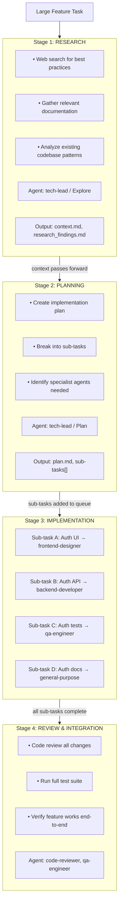
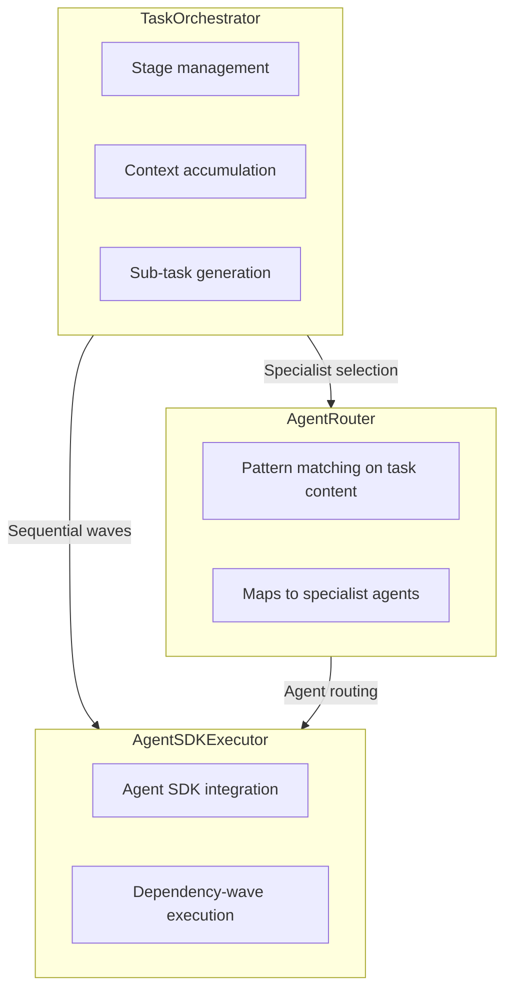
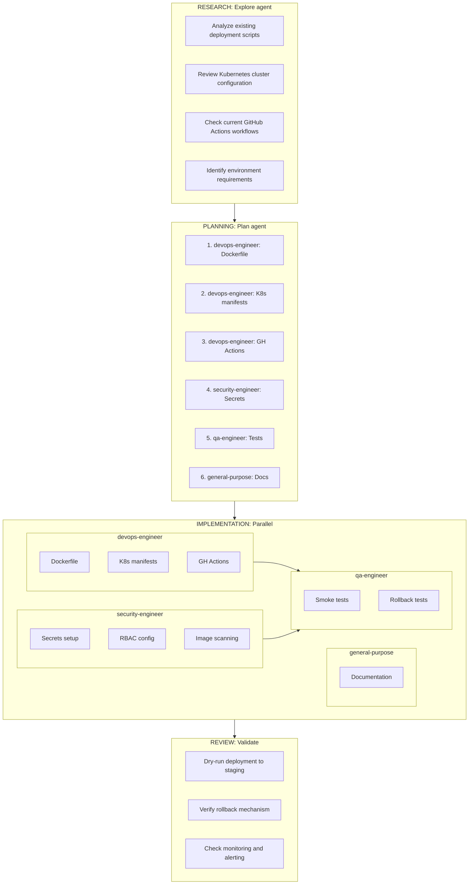
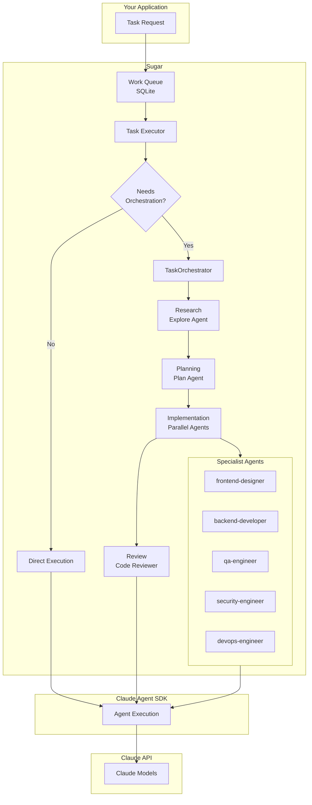

# Task Orchestration System

> **Status: Implemented (v3.10+).** Orchestration is wired into the live Sugar
> loop - `sugar add "..." --orchestrate` then `sugar run` decomposes the task,
> runs all four stages, persists and executes subtasks in dependency order, and
> `sugar orchestrate <id>` / `sugar context <id>` show the live persisted state.
> Subtasks execute in dependency order, sequentially within each wave;
> intra-wave parallelism is planned (see [Out of scope](#out-of-scope)).

Sugar's Task Orchestration system enables intelligent decomposition and execution of complex features through staged workflows and specialist agent routing.

## Overview

When Sugar encounters a large feature request, the orchestration system:

1. **Detects** that the task requires decomposition
2. **Researches** context via web search and codebase analysis
3. **Plans** the implementation and generates sub-tasks
4. **Routes** each sub-task to the appropriate specialist agent
5. **Executes** sub-tasks in dependency order (sequentially within each wave;
   intra-wave parallelism is planned)
6. **Reviews** the completed work before marking done



## Architecture



## Configuration

```yaml
# .sugar/config.yaml
orchestration:
  enabled: true

  # When to trigger orchestration
  # - auto: System detects complex tasks automatically
  # - explicit: Only when task has orchestrate: true flag
  # - disabled: Never orchestrate, run tasks directly
  auto_decompose: "auto"

  # Detection rules for auto mode
  detection:
    # Task types that always trigger orchestration
    task_types: ["feature", "epic"]

    # Keywords in title/description that trigger orchestration
    keywords:
      - "implement"
      - "build"
      - "create full"
      - "add complete"
      - "redesign"
      - "refactor entire"

    # Minimum estimated complexity (future: AI-based estimation)
    min_complexity: "high"  # low, medium, high

  # Stage definitions
  stages:
    research:
      enabled: true
      agent: "Explore"
      timeout: 600  # 10 minutes
      actions:
        - web_search
        - codebase_analysis
        - doc_gathering
      output_to_context: true
      output_path: ".sugar/orchestration/{task_id}/research.md"

    planning:
      enabled: true
      agent: "Plan"
      timeout: 300  # 5 minutes
      depends_on: ["research"]
      creates_subtasks: true
      output_path: ".sugar/orchestration/{task_id}/plan.md"

    implementation:
      parallel: true              # planned: intra-wave parallelism (not yet honored)
      max_concurrent: 3
      timeout_per_task: 1800  # 30 minutes per sub-task
      agent_routing:
        # Pattern → Agent mapping
        "*ui*|*frontend*|*component*|*design*": "frontend-designer"
        "*api*|*backend*|*endpoint*|*service*": "backend-developer"
        "*test*|*spec*|*coverage*": "qa-engineer"
        "*security*|*auth*|*permission*": "security-engineer"
        "*devops*|*deploy*|*ci*|*docker*": "devops-engineer"
        "*doc*|*readme*|*guide*": "general-purpose"
        "default": "general-purpose"

    review:
      enabled: true
      depends_on: ["implementation"]
      agents:
        - "code-reviewer"
        - "qa-engineer"
      run_tests: true
      require_passing: true
```

## Components

### TaskOrchestrator

The main orchestration engine that manages the workflow.

```python
class TaskOrchestrator:
    """
    Orchestrates complex tasks through staged execution.

    Responsibilities:
    - Detect if task requires orchestration
    - Manage stage transitions
    - Accumulate context between stages
    - Track sub-task completion
    - Trigger review stage when implementation complete
    """

    async def should_orchestrate(self, task: Task) -> bool:
        """Determine if task needs orchestration based on config."""

    async def orchestrate(self, task: Task) -> OrchestrationResult:
        """Run full orchestration workflow for a task."""

    async def run_stage(self, stage: Stage, context: Context) -> StageResult:
        """Execute a single stage of the workflow."""

    async def generate_subtasks(self, plan: Plan) -> List[Task]:
        """Generate sub-tasks from planning stage output."""
```

### AgentRouter

Routes tasks to appropriate specialist agents.

```python
class AgentRouter:
    """
    Routes tasks to specialist agents based on content analysis.

    Supports:
    - Pattern matching on task title/description
    - Task type based routing
    - Fallback to default agent
    """

    def route(self, task: Task) -> str:
        """Return the agent name for a task."""

    def get_available_agents(self) -> List[str]:
        """List available specialist agents."""
```

### Available Specialist Agents

These map to Claude Code's built-in agent types:

| Agent | Use Case |
|-------|----------|
| `general-purpose` | Default for most tasks |
| `tech-lead` | Architecture, planning, complex decisions |
| `code-reviewer` | Code review, refactoring feedback |
| `frontend-designer` | UI/UX, components, styling |
| `backend-developer` | APIs, databases, server logic |
| `qa-engineer` | Testing, test strategies, coverage |
| `security-engineer` | Security audits, auth, vulnerabilities |
| `devops-engineer` | CI/CD, infrastructure, deployment |
| `Explore` | Codebase exploration, research |
| `Plan` | Implementation planning |

## Workflow Example

### Input Task

```bash
sugar add "Add user authentication with OAuth support" --type feature
```

### Stage 1: Research

The Explore agent:
- Searches web for "OAuth 2.0 best practices 2025"
- Analyzes codebase for existing auth patterns
- Checks for existing user models
- Reviews dependencies (existing auth libraries)

> **Read-only stage.** Research (and planning) run with a restricted,
> read-only tool set (`Read`, `Glob`, `Grep`, `WebSearch`, `WebFetch`) so the
> agent gathers context and cannot jump ahead to writing files. Set
> `read_only: false` on the stage (or supply an explicit `allowed_tools`
> list) in `.sugar/config.yaml` to lift this.

Output saved to `.sugar/orchestration/{task_id}/research.md`:

```markdown
# Research: OAuth Authentication

## Web Research
- OAuth 2.0 recommended flow: Authorization Code with PKCE
- Popular libraries: authlib (Python), passport (Node)
- Security considerations: token storage, CSRF protection

## Codebase Analysis
- Existing User model in `app/models/user.py`
- No current auth implementation
- Using FastAPI framework
- SQLAlchemy for ORM

## Recommendations
- Use authlib for OAuth implementation
- Add OAuth provider configuration
- Implement token refresh mechanism
```

### Stage 2: Planning

The Plan agent reads research context and creates:

```markdown
# Implementation Plan: OAuth Authentication

## Sub-tasks

1. **Create OAuth Configuration**
   - Add OAuth provider settings
   - Environment variables for client ID/secret
   - Agent: backend-developer

2. **Implement OAuth Routes**
   - /auth/login - Initiate OAuth flow
   - /auth/callback - Handle OAuth callback
   - /auth/logout - Clear session
   - Agent: backend-developer

3. **Create Login UI**
   - Login page with OAuth buttons
   - Loading states
   - Error handling
   - Agent: frontend-designer

4. **Add Session Management**
   - JWT token generation
   - Token refresh logic
   - Session storage
   - Agent: security-engineer

5. **Write Tests**
   - Unit tests for OAuth flow
   - Integration tests for routes
   - E2E login flow test
   - Agent: qa-engineer

6. **Update Documentation**
   - Auth setup guide
   - Environment variables
   - API documentation
   - Agent: general-purpose

## Dependencies
- Tasks 1 must complete before 2, 3, 4
- Tasks 2, 3, 4 can run in parallel
- Task 5 depends on 2, 3, 4
- Task 6 can run anytime
```

### Stage 3: Implementation

Sub-tasks added to queue with relationships:

```
Parent: "Add user authentication with OAuth support" (orchestrating)
  ├── Sub-task 1: "Create OAuth Configuration" (pending)
  ├── Sub-task 2: "Implement OAuth Routes" (blocked by 1)
  ├── Sub-task 3: "Create Login UI" (blocked by 1)
  ├── Sub-task 4: "Add Session Management" (blocked by 1)
  ├── Sub-task 5: "Write Tests" (blocked by 2,3,4)
  └── Sub-task 6: "Update Documentation" (pending)
```

Execution order:
1. Tasks 1 and 6 start (no blockers)
2. When 1 completes → Tasks 2, 3, 4 start in parallel
3. When 2, 3, 4 complete → Task 5 starts
4. When all complete → Stage 4 triggers

> **Implementation note (v3.10).** The shipped executor runs subtasks
> **sequentially within each dependency wave** - it does not run a wave's
> tasks concurrently. The ordering above (dependency waves) is honored; the
> "in parallel" wording describes the target design, not the current
> behavior. Intra-wave parallelism is tracked as future work
> (see [Out of scope](#out-of-scope)).

### Stage 4: Review

The code-reviewer agent:
- Reviews all file changes from sub-tasks
- Checks for code quality issues
- Verifies patterns are consistent

The qa-engineer agent:
- Runs full test suite
- Verifies OAuth flow works end-to-end
- Reports any failures

If review passes → Parent task marked complete
If review fails → Issues added as new tasks

## Task Schema Extensions

```python
@dataclass
class Task:
    id: str
    title: str
    description: str
    type: str  # bug_fix, feature, epic, etc.
    priority: int

    # Orchestration fields
    orchestrate: bool = False  # Explicit orchestration flag
    parent_task_id: Optional[str] = None  # Link to parent
    stage: Optional[str] = None  # Current stage
    blocked_by: List[str] = field(default_factory=list)  # Task IDs

    # Context accumulation
    context_path: Optional[str] = None  # Path to accumulated context

    # Routing
    assigned_agent: Optional[str] = None  # Specialist agent
```

## Context Accumulation

Each stage can read context from previous stages:

```python
class OrchestrationContext:
    """Accumulated context across orchestration stages."""

    task_id: str
    base_path: Path  # .sugar/orchestration/{task_id}/

    def add_research(self, content: str) -> None:
        """Add research findings."""

    def add_plan(self, content: str) -> None:
        """Add implementation plan."""

    def add_subtask_result(self, subtask_id: str, result: str) -> None:
        """Add result from completed sub-task."""

    def get_full_context(self) -> str:
        """Get accumulated context for current stage."""

    def get_files_modified(self) -> List[str]:
        """Get all files modified across sub-tasks."""
```

## CLI Commands

```bash
# Add task with explicit orchestration
sugar add "Build payment system" --type feature --orchestrate

# View orchestration status
sugar status --orchestration

# View specific task's orchestration
sugar show <task_id> --stages

# Skip to implementation (bypass research/planning)
sugar add "Add logout button" --type feature --skip-stages research,planning

# Re-run a stage
sugar orchestrate <task_id> --stage planning

# View orchestration context
sugar context <task_id>
```

## Future Enhancements

### AI-Based Complexity Detection

Instead of keyword matching, use AI to estimate task complexity:

```python
async def estimate_complexity(task: Task) -> ComplexityScore:
    """Use AI to estimate if task needs orchestration."""
    prompt = f"""
    Analyze this task and estimate complexity:
    Title: {task.title}
    Description: {task.description}

    Consider:
    - Number of files likely affected
    - Number of different concerns (UI, API, DB, etc.)
    - Integration complexity
    - Testing requirements

    Return: low, medium, or high
    """
```

### Learning from History

Track orchestration outcomes to improve:
- Which task types benefit most from orchestration
- Optimal stage configurations
- Agent routing accuracy
- Time savings from parallelization

### Custom Stage Definitions

Allow users to define custom stages:

```yaml
orchestration:
  custom_stages:
    security_audit:
      enabled: true
      agent: "security-engineer"
      after: "implementation"
      before: "review"
      actions:
        - security_scan
        - vulnerability_check
```

## Execution Architecture

The orchestration system reuses the live executor for every stage and subtask.
There is no separate parallel-execution primitive; subtasks run through the same
`AgentSDKExecutor` used for ordinary tasks, so model routing, hooks, quality
gates, and thinking capture all apply.

| Layer | Component | Responsibility |
|-------|-----------|----------------|
| High | TaskOrchestrator | Workflow stages, context accumulation |
| Mid | AgentRouter | Specialist selection (role-priming) |
| Base | AgentSDKExecutor | Individual stage + subtask execution |

The implementation stage runs subtasks in **dependency waves**: each wave
collects the subtasks whose blockers are all completed, executes them
**sequentially** (the cached per-model `SugarAgent` holds mutable session
state, so concurrent calls on it would race), marks each completed or
failed, then advances to the next wave until none remain.

```python
# Simplified: dependency-wave execution via the live executor
async def run_implementation_stage(self, parent_id, subtasks):
    # 1. persist subtasks (status="hold") + remap placeholder -> real ids
    # 2. wave loop:
    while remaining:
        ready = [s for s in remaining if blockers_complete(s)]
        if not ready:
            break  # nothing runnable (e.g. all remaining are deadlocked)
        for subtask in ready:           # sequential within the wave
            await self.agent_executor.execute_work(subtask)
            await self.work_queue.complete_work(subtask["id"], result)
        remaining = [s for s in remaining if s not in ready]
```

> Specialist agent names (`backend-developer`, `frontend-designer`, etc.)
> are not built-in Claude Code subagent types. They prime the subtask prompt
> with a `## Acting as: {agent}` role header and are stored on the subtask for
> visibility. Real subagent-type dispatch is future work.

## Real-World Example Scenarios

### Example 1: E-Commerce Payment Integration

A team needs to integrate Stripe payment processing into their e-commerce platform.

```bash
sugar add "Integrate Stripe payment processing" --type feature
```

**Stage 1: Research**
The Explore agent:
- Searches for Stripe API best practices and PCI compliance requirements
- Analyzes existing checkout flow in the codebase
- Identifies current order and cart models
- Reviews existing payment placeholders

**Stage 2: Planning**
The Plan agent creates subtasks:
```
1. backend-developer: Create Stripe configuration and API wrapper
2. backend-developer: Implement payment intent creation endpoint
3. backend-developer: Add webhook handlers for payment events
4. frontend-designer: Build payment form with Stripe Elements
5. security-engineer: Implement PCI-compliant token handling
6. qa-engineer: Write payment flow tests (success, failure, refunds)
7. general-purpose: Update checkout documentation
```

**Stage 3: Implementation**
Parallel execution groups:
- Group 1: Config + Webhook handlers (no dependencies)
- Group 2: Payment endpoints + UI (after config)
- Group 3: Tests + Docs (after implementation)

**Stage 4: Review**
- Security review of token handling
- Test payment flow end-to-end with Stripe test mode
- Verify PCI compliance measures

---

### Example 2: API Platform with GraphQL

Building a new GraphQL API layer on top of existing REST services.

```bash
sugar add "Build GraphQL API layer for user management" --type feature
```

**How Orchestration Helps:**

| Stage | What Happens | Value Added |
|-------|--------------|-------------|
| Research | Analyzes existing REST endpoints, identifies data models, reviews GraphQL schema patterns | Understands existing architecture before proposing changes |
| Planning | Creates schema design, identifies resolvers needed, plans authentication integration | Ensures comprehensive coverage of all endpoints |
| Implementation | Parallel work on schema, resolvers, auth middleware, client SDK | 3x faster than sequential development |
| Review | Schema validation, resolver testing, performance benchmarking | Catches N+1 queries and auth gaps |

**Subtask Breakdown:**
```
Schema & Types (backend-developer)
├── Define User type and queries
├── Define mutations (createUser, updateUser, deleteUser)
└── Add input types and validation

Resolvers (backend-developer)
├── User query resolvers
├── Mutation resolvers with REST service calls
└── DataLoader for batching

Auth & Middleware (security-engineer)
├── JWT validation middleware
├── Permission directives
└── Rate limiting

Testing (qa-engineer)
├── Schema snapshot tests
├── Resolver unit tests
└── Integration tests with mocked REST services

Documentation (general-purpose)
├── Schema documentation
├── Authentication guide
└── Example queries and mutations
```

---

### Example 3: CI/CD Pipeline Setup

Setting up a complete CI/CD pipeline for a new microservice.

```bash
sugar add "Set up CI/CD pipeline with GitHub Actions and Kubernetes" --type feature
```

**Orchestration Flow:**



---

### Example 4: Full-Stack Dashboard Feature

Building an analytics dashboard with real-time updates.

```bash
sugar add "Build real-time analytics dashboard" --type feature --orchestrate
```

**Agent Routing in Action:**

| Subtask | Assigned Agent | Reasoning |
|---------|----------------|-----------|
| Design dashboard layout and components | frontend-designer | Contains "dashboard", "design", "components" |
| Create WebSocket server for real-time data | backend-developer | Contains "server", "data" |
| Implement chart components with D3.js | frontend-designer | Contains "components" |
| Add user preference storage | backend-developer | Contains "storage" |
| Write component tests | qa-engineer | Contains "tests" |
| Set up WebSocket authentication | security-engineer | Contains "authentication" |
| Configure CDN for static assets | devops-engineer | Contains "CDN", "assets" |

**Parallel Execution Benefits:**
- Frontend and backend work happens simultaneously
- Tests are written as features are built
- Security review runs in parallel with documentation
- Total time: ~40% of sequential execution

---

## When Orchestration Shines

### Best Use Cases

1. **Cross-cutting features** - Features that touch UI, API, database, and tests
2. **Complex integrations** - Third-party API integrations requiring research
3. **New subsystems** - Building entirely new functionality from scratch
4. **Refactoring epics** - Large-scale code modernization efforts
5. **Security implementations** - Auth, encryption, compliance features

### Signs a Task Needs Orchestration

- Description includes multiple technical domains (frontend + backend + database)
- Requires research before implementation can begin
- Will touch more than 10 files
- Needs coordination between different specialties
- Has complex dependencies between subtasks

### When to Skip Orchestration

- Simple bug fixes (one file, clear solution)
- Documentation updates
- Minor UI tweaks
- Configuration changes
- Single-endpoint API additions

## Architecture Integration



This architecture enables Sugar to handle everything from simple one-liner fixes to complex multi-day feature implementations, automatically choosing the right level of sophistication for each task.

## Out of scope

The following are intentionally deferred (tracked as follow-ups):

- **Intra-wave parallel subtask execution.** Subtasks run sequentially within each
  dependency wave because the cached `SugarAgent` mutates shared instance state
  during execution. Per-subtask agent isolation is required before subtasks in the
  same wave can run concurrently.
- **Queue-driven parent-wake (Model B).** Today orchestration runs synchronously
  within a single loop slot (Model A): the parent is claimed, all four stages run,
  and subtasks are persisted as `hold`-status rows the orchestrator executes
  itself. A queue-driven model where the parent holds while children run as
  independent queue items (better for long-running/crash-recovery) is future work.
- **Quality-gate integration in review.** `WorkflowOrchestrator.quality_gates` are
  not yet wired into the review stage; review runs the routed reviewer and
  optionally the project test suite (`run_tests` / `require_passing`).
- **Real Claude-Code subagent-type dispatch.** Specialist agent names
  (`backend-developer`, etc.) prime the subtask prompt with a role header and are
  stored on the row for visibility; they are not yet dispatched as native
  subagent types.
- **Robust plan parser.** `generate_subtasks` uses a regex parser; a more
  tolerant parser is a follow-up.
